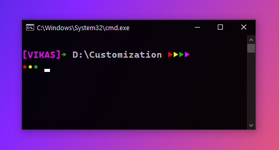
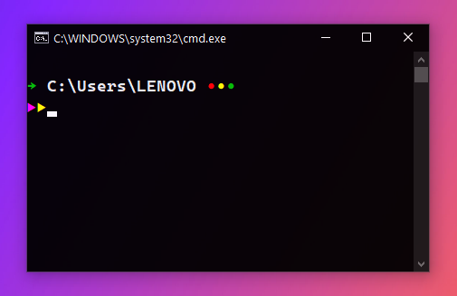
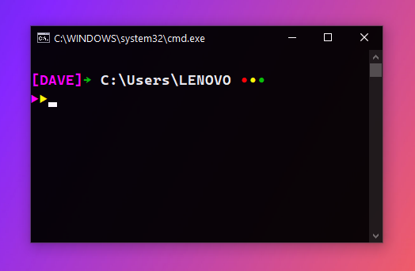
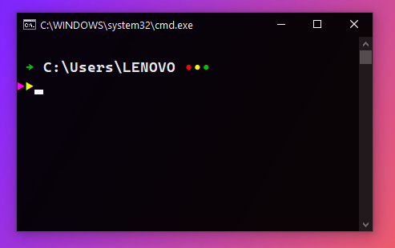
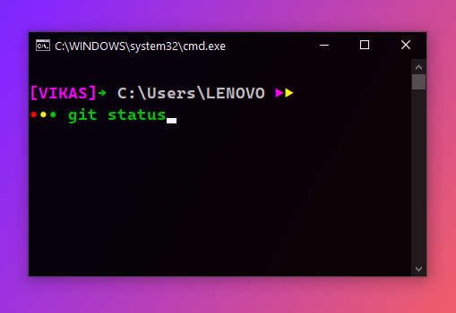

# Set default prompt : 

* Set font to  `Cascadia Code PL` or &nbsp;`MesloLGM NF`   
* Create an environment variable `PROMPT` and set the value to :  

## Prompt 1  

>   $E[1;35m[VIKAS]$E[1;32m→ $E[0;37m$p $E[1;31m▶$E[1;33m▶$E[1;32m▶$E[1;35m▶  $_$E[1;31m•$E[1;33m•$E[1;32m• $E[1;33m

## Prompt 2   
  
>   $E[1;46;40m$E[1;32;40m→ $E[1;36;40m$p $E[1;31;40m•$E[1;33;40m•$E[1;32;40m• $_$E[1;35;40m▶$E[1;33;40m▶

## Prompt 3   
  
>     $E[1;35m[%ComputerName%]$E[1;32m→ $E[1;36m$p $E[1;31m•$E[1;33m•$E[1;32m• $_$E[1;35m▶$E[1;33m▶

## Prompt 4   
  
>    $E[1;36m $E[1;32m→ $E[1;36m$p $E[1;31m•$E[1;33m•$E[1;32m• $_$E[1;35m▶$E[1;33m▶ 

## Prompt 5   
  
>   $E[1;35m[VIKAS]$E[1;32m→ $E[0;37m$p $E[1;35m▶$E[1;33m▶  $_$E[1;31m•$E[1;33m•$E[1;32m• 

