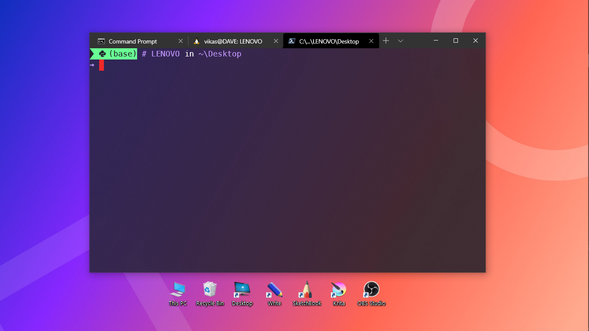

# MY CUSTOMIZATIONS FOR WINDOWS 10

<kbd>[Powershell](Powershell/README.md)</kbd>
<kbd>[Commnd Prompt](Command%20Prompt/README.md)</kbd>
 
## Fonts for Terminal
|                        |
| :--------------------- |
| ___MesloLGM NF___      |
| ___Cascadia Code PL___ |
| ___Hack___             |
|                        |

## Code Editors of Choice
|                      |
| :------------------- |
| ___VS Code___        |
| ___Sublime Text 3___ |
| ___vim___            |
|                      |

## Terminal of Choice
|                              |
| :--------------------------- |
| ___Windows Terminal___       |
| ___Powershell 7___           |
| ___windows command prompt___ |
| ___zsh___                    |
|                              |

## Music Player of Choice
|                |
| :------------- |
| ___MusicBee___ |
| ___Spotify___  |
|                |

## Web Browser of Choice
|               |
| :------------ |
| ___Firefox___ |
| ___MS Edge___ |
| ___Chrome___  |
|               |

## OS of Choice
|                                 |
| :------------------------------ |
| ___Windows 10__ (Version 2004)_ |
| ___Ubuntu__ (WSL 2)_            |
|                                 |

